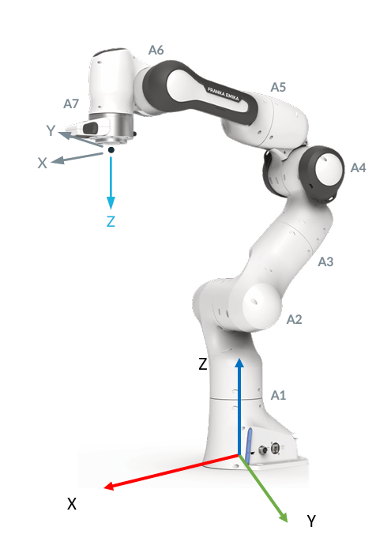

# FK_IK_Lib - Forward and Inverse Kinematics Library

A comprehensive MATLAB library for robot kinematics, implementing both forward and inverse kinematics algorithms along with various analysis tools for robotic manipulators.



## Overview

This library provides a robust set of tools for analyzing and controlling robotic manipulators, with a focus on:
- Forward Kinematics (FK) calculations in both space and body frames
- Multiple Inverse Kinematics (IK) algorithms
- Jacobian analysis and manipulation
- Singularity detection and handling
- Kinematic performance metrics

## Key Features

### Forward Kinematics
- Space frame forward kinematics (`FK_space`)
- Body frame forward kinematics (`FK_body`)
- Support for SE(3) transformations and twists

### Inverse Kinematics
Multiple IK algorithms implemented:
- Jacobian inverse method (`J_inverse_kinematics`)
- Damped least squares method (`DLS_inverse_kinematics`)
- Jacobian transpose method (`J_transpose_kinematics`)
- Redundancy resolution capabilities

### Analysis Tools
- Jacobian analysis in both space and body frames
- Singularity detection
- Kinematic performance metrics:
  - Manipulability ellipsoid visualization
  - Condition number analysis
  - Isotropy measures
  - Ellipsoid volume calculations

### Utility Functions
- SE(3) and SO(3) transformations
- Twist and adjoint operations
- Axis-angle representations
- Vector and matrix conversions

## Getting Started

Each function in the library includes a corresponding test file (e.g., `FK_space_test.m`, `J_inverse_kinematics_test.m`) to demonstrate its usage and verify functionality. The library includes comprehensive test cases for the Franka Emika Panda robot, demonstrating:

- Forward kinematics calculations in both space and body frames
- Multiple inverse kinematics solutions
- Jacobian analysis and singularity detection
- Kinematic performance evaluation
- Redundancy resolution

Example usage with the Franka Emika Panda robot:
```matlab
% Forward Kinematics example
theta = [0, -pi/4, 0, -3*pi/4, 0, pi/2, pi/4];  % Joint angles
T = FK_space(theta);  % Get end-effector pose

% Inverse Kinematics example
T_desired = [eye(3) [0.5; 0.2; 0.3]; 0 0 0 1];  % Desired pose
theta_solution = J_inverse_kinematics(T_desired, theta_initial);
```

## Dependencies
- MATLAB
- Robotics System Toolbox (for some visualization features)
