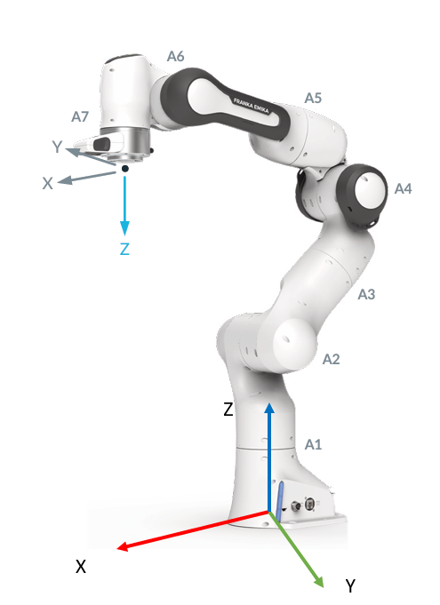

# FK_IK_Lib - Forward and Inverse Kinematics Library

A comprehensive MATLAB library for robot kinematics, implementing both forward and inverse kinematics algorithms along with various analysis tools for robotic manipulators.



## Overview

This library provides a robust set of tools for analyzing and controlling robotic manipulators, with a focus on:
- Forward Kinematics (FK) calculations in both space and body frames
- Multiple Inverse Kinematics (IK) algorithms
- Jacobian analysis and manipulation
- Singularity detection and handling
- Kinematic performance metrics

## Robot Kinematics

### Forward Kinematics
- Space frame forward kinematics (`FK_space`)
- Body frame forward kinematics (`FK_body`)
- Support for SE(3) transformations and twists

### Inverse Kinematics
Multiple IK algorithms implemented:
- Jacobian inverse method (`J_inverse_kinematics`)
- Damped least squares method (`DLS_inverse_kinematics`)
- Jacobian transpose method (`J_transpose_kinematics`)
- Redundancy resolution capabilities

### Analysis Tools
- Jacobian analysis in both space and body frames
- Singularity detection
- Kinematic performance metrics:
  - Manipulability ellipsoid visualization
  - Condition number analysis
  - Isotropy measures
  - Ellipsoid volume calculations

### Utility Functions
- SE(3) and SO(3) transformations
- Twist and adjoint operations
- Axis-angle representations
- Vector and matrix conversions

### Sensor Data Integration

### Point Set Registration

SVD is used to estimate the optimal rotation matrix $\mathbf{R}$ that aligns the centered point clouds.

1. Compute centroids:

```math
   \overline{\mathbf{p}} = \frac{1}{N} \sum_{i=1}^N \mathbf{p}_i, \quad \overline{\mathbf{q}} = \frac{1}{N} \sum_{i=1}^N \mathbf{q}_i
```

2. Center the points:

```math
   \mathbf{p}_i' = \mathbf{p}_i - \overline{\mathbf{p}}, \quad \mathbf{q}_i' = \mathbf{q}_i - \overline{\mathbf{q}}
```

3. Compute the cross-covariance matrix:

```math
   \mathbf{H} = \sum_{i=1}^N \mathbf{p}_i' (\mathbf{q}_i')^T
```

4. Perform SVD:

```math
   \mathbf{H} = \mathbf{U} \mathbf{\Sigma} \mathbf{V}^T
```

5. Compute rotation:

```math
   \mathbf{R} = \mathbf{V} \mathbf{U}^T
```

6. Ensure $\mathbf{R} \in SO(3)$ by checking $\det(\mathbf{R}) = 1$. If $\det(\mathbf{R}) < 0$, adjust $\mathbf{V}$:

```math
   \mathbf{V}' = \mathbf{V} \cdot \text{diag}(1, 1, -1), \quad \mathbf{R} = \mathbf{V}' \mathbf{U}^T
```

### Quaternion-Based Rotation Estimation

1. Compute the centroids of the point sets:

```math
   \overline{\mathbf{a}} = \frac{1}{N} \sum_{i=1}^N \mathbf{a}_i, \quad \overline{\mathbf{b}} = \frac{1}{N} \sum_{i=1}^N \mathbf{b}_i
```

2. Center the point sets:

```math
   \mathbf{a}_i' = \mathbf{a}_i - \overline{\mathbf{a}}, \quad \mathbf{b}_i' = \mathbf{b}_i - \overline{\mathbf{b}}
```

3. Construct the $4 \times 4$ matrix $\mathbf{M}$ by summing contributions from each point pair:

```math
   \mathbf{M} = \sum_{i=1}^N \mathbf{M}_i^T \mathbf{M}_i
```

4. Perform eigenvalue decomposition on $\mathbf{M}$:

```math
   \mathbf{M} \mathbf{q} = \lambda \mathbf{q}
```

where $\mathbf{q}$ is an eigenvector, and $\lambda$ is the corresponding eigenvalue.

5. Select the eigenvector $\mathbf{q} = [q_0, q_1, q_2, q_3]^T$ corresponding to the smallest eigenvalue as the unit quaternion.

6. Convert the quaternion to a rotation matrix $\mathbf{R}$:

```math
   \mathbf{R} = \begin{bmatrix}
   q_0^2 + q_1^2 - q_2^2 - q_3^2 & 2(q_1 q_2 - q_0 q_3) & 2(q_1 q_3 + q_0 q_2) \\
   2(q_1 q_2 + q_0 q_3) & q_0^2 - q_1^2 + q_2^2 - q_3^2 & 2(q_2 q_3 - q_0 q_1) \\
   2(q_1 q_3 - q_0 q_2) & 2(q_2 q_3 + q_0 q_1) & q_0^2 - q_1^2 - q_2^2 + q_3^2
   \end{bmatrix}
```

### Eigenvalue Decomposition for Rotation Estimation

1. Compute the centroids of the point sets:

```math
   \overline{\mathbf{a}} = \frac{1}{N} \sum_{i=1}^N \mathbf{a}_i, \quad \overline{\mathbf{b}} = \frac{1}{N} \sum_{i=1}^N \mathbf{b}_i
```

2. Compute the cross-covariance matrix $\mathbf{H}$:

```math
   \mathbf{H} = \sum_{i=1}^N (\mathbf{a}_i - \overline{\mathbf{a}}) (\mathbf{b}_i - \overline{\mathbf{b}})^T
```

3. Construct the $4 \times 4$ matrix $\mathbf{G}$:

```math
   \mathrm{tr}(\mathbf{H}) = h_{11} + h_{22} + h_{33}
```

```math
   \Delta = \begin{bmatrix} h_{23} - h_{32} \\ h_{31} - h_{13} \\ h_{12} - h_{21} \end{bmatrix}
```

```math
   \mathbf{G} = \begin{bmatrix}
   \mathrm{tr}(\mathbf{H}) & \Delta^T \\
   \Delta & \mathbf{H} + \mathbf{H}^T - \mathrm{tr}(\mathbf{H}) \mathbf{I}_3
   \end{bmatrix}
```
   where $h_{ij}$ are elements of $\mathbf{H}$, and $\mathbf{I}_3$ is the $3 \times 3$ identity matrix.

4. Perform eigenvalue decomposition on $\mathbf{G}$:

```math
   \mathbf{G} \mathbf{q} = \lambda \mathbf{q}
```

   where $\mathbf{q}$ is an eigenvector, and $\lambda$ is the corresponding eigenvalue.

5. Select the eigenvector $\mathbf{q} = [q_0, q_1, q_2, q_3]^T$ corresponding to the largest eigenvalue as the unit quaternion.

6. Convert the quaternion to a rotation matrix $\mathbf{R}$:

```math
   \mathbf{R} = \begin{bmatrix}
   q_0^2 + q_1^2 - q_2^2 - q_3^2 & 2(q_1 q_2 - q_0 q_3) & 2(q_1 q_3 + q_0 q_2) \\
   2(q_1 q_2 + q_0 q_3) & q_0^2 - q_1^2 + q_2^2 - q_3^2 & 2(q_2 q_3 - q_0 q_1) \\
   2(q_1 q_3 - q_0 q_2) & 2(q_2 q_3 + q_0 q_1) & q_0^2 - q_1^2 - q_2^2 + q_3^2
   \end{bmatrix}
```

### Pivot Calibration

For each measurement $k$, we have known $\mathbf{R}_k$ and $\mathbf{p}_k$ by a correspondence method, then we can write:

```math
\mathbf{b}_{\mathrm{post}} = \mathbf{R}_k \mathbf{b}_{\mathrm{tip}} + \mathbf{p}_k
```

We can rewrite this equation as:

```math
\mathbf{R}_k \mathbf{b}_{\mathrm{tip}} - \mathbf{b}_{\mathrm{post}} = -\mathbf{p}_k
```

So, we can set up a least squares problem in the form of $\mathbf{A}\mathbf{x} = \mathbf{b}$ as follows and find the unknowns $\mathbf{b}_{\mathrm{tip}}$ and $\mathbf{b}_{\mathrm{post}}$:

```math
\begin{bmatrix}
  \vdots & \vdots \\
  \mathbf{R}_k & -\mathbf{I} \\
  \vdots & \vdots
\end{bmatrix}
\begin{bmatrix}
    \mathbf{b}_{\mathrm{tip}} \\
    \mathbf{b}_{\mathrm{post}}
\end{bmatrix} =
\begin{bmatrix}
  \vdots \\
  -\mathbf{p}_k \\
  \vdots
\end{bmatrix}
```

## Constrained Control

### Reaching a Point

The constrained control problem for reaching a point can be formulated as:
```math
\begin{aligned}
\Delta \mathbf{q}_{\text{des}} &= \arg \min_{\Delta \mathbf{q}} \left\| \mathbf{D}(\Delta \mathbf{x}) \right\|^2 = \left\| \alpha \times \mathbf{t} + \epsilon + \mathbf{t} - \mathbf{p}_{\text{goal}} \right\|^2 \\
\alpha &= \mathbf{J}_{\alpha}(\mathbf{q}) \Delta \mathbf{q} \\
\epsilon &= \mathbf{J}_{\epsilon}(\mathbf{q}) \Delta \mathbf{q} \\
\| \alpha \times \mathbf{t} + \epsilon + &\mathbf{t} - \mathbf{p}_{\text{goal}} \| \leq 3 \\
\mathbf{q}_L - \mathbf{q} &\leq \Delta \mathbf{q} \leq \mathbf{q}_U - \mathbf{q}
\end{aligned}
```

### Reaching a Point while Optimizing Oritentation
```math
\begin{aligned}
  \Delta \mathbf{q}_{\text{des}} &= \arg \min_{\Delta \mathbf{q}} \left\| \mathbf{D}(\Delta \mathbf{x}) \right\|^2 = \left\| \alpha \times \mathbf{t} + \epsilon + \mathbf{t} - \mathbf{p}_{\text{goal}} \right\|^2 + \eta \|\alpha \times \mathbf{R} \cdot \mathbf{z}\|^2\\
  \alpha &= \mathbf{J}_{\alpha}(\mathbf{q}) \Delta \mathbf{q} \\
  \epsilon &= \mathbf{J}_{\epsilon}(\mathbf{q}) \Delta \mathbf{q} \\
  \| \alpha \times &\mathbf{t} + \epsilon + \mathbf{t} - \mathbf{p}_{\text{goal}} \| \leq 3 \\
  \mathbf{q}_L - \mathbf{q} &\leq \Delta \mathbf{q} \leq \mathbf{q}_U - \mathbf{q}
\end{aligned}
```

### Reaching a Point with Wall Contraint
```math
\begin{aligned}
  \Delta \mathbf{q}_{\text{des}} &= \arg \min_{\Delta \mathbf{q}} \left\| \mathbf{D}(\Delta \mathbf{x}) \right\|^2 = \left\| \alpha \times \mathbf{t} + \epsilon + \mathbf{t} - \mathbf{p}_{\text{goal}} \right\|^2 + \eta \|\alpha \times \mathbf{R} \cdot \mathbf{z}\|^2\\
  \alpha &= \mathbf{J}_{\alpha}(\mathbf{q}) \Delta \mathbf{q} \\
  \epsilon &= \mathbf{J}_{\epsilon}(\mathbf{q}) \Delta \mathbf{q} \\
  \mathbf{n}_{\text{wall}} & \cdot( \alpha \times \mathbf{t} + \epsilon + \mathbf{t} - \mathbf{p}_{\text{wall}}) \ge 0 \\
  \| \alpha \times &\mathbf{t} + \epsilon + \mathbf{t} - \mathbf{p}_{\text{goal}} \| \leq 3 \\
  \mathbf{q}_L - \mathbf{q} &\leq \Delta \mathbf{q} \leq \mathbf{q}_U - \mathbf{q}
\end{aligned}
```


## Getting Started

Each function in the library includes a corresponding test file (e.g., `FK_space_test.m`, `J_inverse_kinematics_test.m`) to demonstrate its usage and verify functionality. The library includes comprehensive test cases for the Franka Emika Panda robot, demonstrating:

- Forward kinematics calculations in both space and body frames
- Multiple inverse kinematics solutions
- Jacobian analysis and singularity detection
- Kinematic performance evaluation
- Redundancy resolution

Example usage with the Franka Emika Panda robot:
```matlab
% Forward Kinematics example
theta = [0, -pi/4, 0, -3*pi/4, 0, pi/2, pi/4];  % Joint angles
T = FK_space(theta);  % Get end-effector pose

% Inverse Kinematics example
T_desired = [eye(3) [0.5; 0.2; 0.3]; 0 0 0 1];  % Desired pose
theta_solution = J_inverse_kinematics(T_desired, theta_initial);
```

## Dependencies
- MATLAB
- Robotics System Toolbox (for some visualization features)
